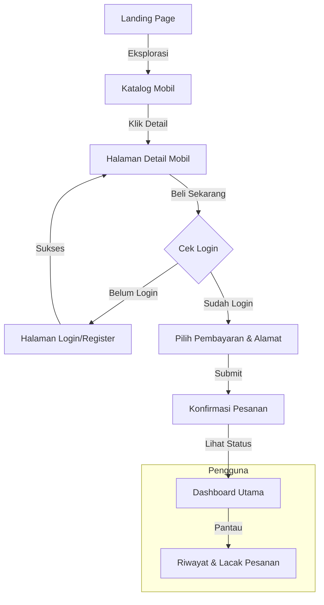

# ShowCar - Platform Jual Beli Mobil Impian

ShowCar adalah prototipe aplikasi web modern untuk layanan jual beli mobil yang dirancang dengan antarmuka yang estetis dan responsif. Aplikasi ini memudahkan pengguna untuk menjelajahi katalog mobil, melihat spesifikasi mendalam, dan melakukan transaksi pembelian secara instan.

## 🚀 Fitur Utama

- **Katalog Dinamis**: Daftar mobil yang diambil secara real-time dari data JSON dengan fitur filter kategori (Sport, SUV, Electric, dll).
- **Sistem Pembelian Cepat**: Fitur pemesanan langsung dengan pilihan metode pembayaran dan input lokasi pengiriman.
- **Dashboard Pengguna**: Panel kendali untuk memantau status pesanan dan riwayat pembelian terakhir.
- **Manajemen Profil**: Halaman profil yang terintegrasi dengan sesi pengguna untuk memperbarui informasi data diri.
- **Responsif**: Desain yang dioptimalkan untuk perangkat mobile maupun desktop menggunakan CSS modern (Flexbox & Grid).

## 🗺️ Alur Pengguna (Flowchart)

Berikut adalah gambaran alur navigasi dan logika aplikasi:



## 🛠️ Teknologi yang Digunakan

- **Frontend**: HTML5, Vanilla CSS3 (Custom Properties & Variables), JavaScript ES6.
- **Data Management**: LocalStorage API untuk simulasi sesi dan transaksi, Fetch API untuk memuat katalog dari file JSON.
- **Assets**: Koleksi gambar mobil berkualitas tinggi dan ikon vektor (SVG).

## 📂 Struktur Proyek

- `index.html`: Landing page utama dan etalase katalog mobil.
- `login.html`: Sistem autentikasi (Masuk & Daftar).
- `dashboard.html`: Halaman manajemen user setelah login.
- `detail.html`: Informasi teknis mobil dan form reservasi.
- `profile.html`: Pengaturan data pribadi pengguna.
- `app.js`: Logika interaktivitas utama aplikasi.
- `styles.css`: Definisi gaya global dan komponen UI.
- `cars.json`: Database sederhana untuk katalog mobil.

## 🏁 Cara Menjalankan

1. Pastikan Anda memiliki browser modern (Chrome, Edge, atau Firefox).
2. Proyek ini memerlukan server lokal untuk menjalankan fitur `fetch`. Jika Anda menggunakan Python, jalankan perintah berikut di direktori proyek:
   ```bash
   python3 -m http.server 8000
   ```
3. Akses aplikasi melalui alamat `http://localhost:8000/index.html`.

## 👤 Penulis
**Muhammad Aryanudin**  
NIM: 43050250033  
Kelas: 2C

---
*Proyek ini dibuat untuk tujuan pengembangan website sederhana dengan standar desain modern.*
